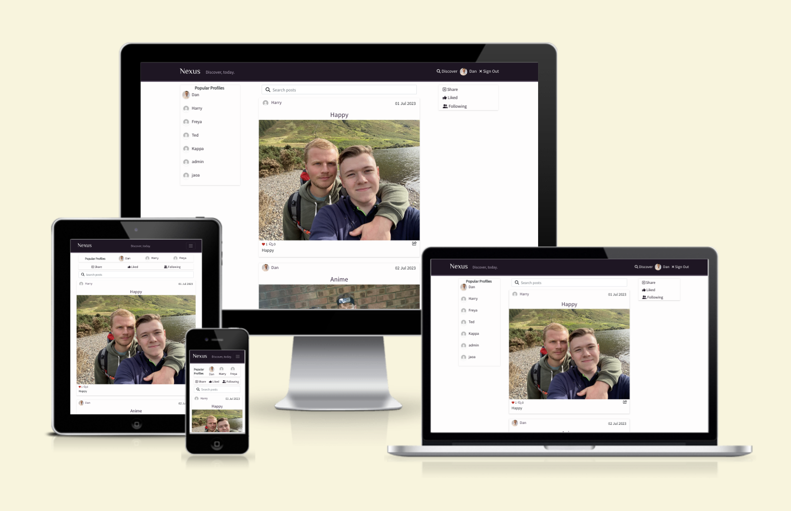

# Nexus
Developed by, [Dan Pearce](https://danpearce.software/)

[Live Website](https://ci-pp5-nexus-drf-danpearce.herokuapp.com/)

Welcome to Nexus! Nexus is a social network built using React. Inspired by Instagram, this site allows users to share their images in posts to interact with other users on the site. Nexus is a community of users who like to keep in touch and share experiences on social media.

Nexus is paired with its sister application Nexus DRF, which is an API using the Django Rest Framework.

You can read more about the DRF Application following the links below:

[View the live Nexus DRF application here](https://ci-pp5-nexus-danpearce.herokuapp.com/)

[View the Nexus DRF GitHub page here](https://github.com/DanPearce/CI_PP5_Nexus_DRF)

## Contents
1. [Application Goals and User Experience](#application-goals-and-user-experience)
    - [User Goals](#user-goals)
    - [Owner Goals](#owner-goals)
    - [Target Audience](#target-audience)
    - [User Expectations](#user-expectations)
2. [User Stories](#user-stories)
3. [Design](#design)
    - [Structure](#structure)
    - [Database and Models](#database-and-models)
    - [Wireframes](#wireframes)
    - [Colour](#colour)
4. [Main Features](#main-features)
5. [Technologies](#technologies)
    - [Languages](#languages)
    - [APIs](#apis)
    - [Libraries, Frameworks and Other Technologies](#libraries-frameworks-and-other-technologies)
6. [Validation and Testing](#validation-and-testing)
    - [HTML Validation](#html-validation)
    - [CSS Validation](#css-validation)
    - [ESLint/JSX](#eslint/jsx)
    - [Accessibility Validation](#accessibility-validation)
    - [Performance Validation](#performance-validation)
    - [Device and Browser Compatibility](#device-and-browser-compatibility)
    - [User Story Testing](#user-story-testing)
7. [Bugs and Errors](#bugs-and-errors)
8. [Deployment](#deployment)
9. [Credits](#credits)
10. [Acknowledgements](#acknowledgements)

## Application Goals and User Experience
### User Goals
- Easily navigate throughout the website with ease.
- Easily distinguish if logged in, use the site in all states.
- Use Nexus to create content and share images.
- Use Nexus to interact with other users and their posts.

### Owner Goals
- Provide the user feedback while using the site.
- Provide the user and experience that is responsive.
- Ensure all users are able to easily naviagte throughout the site.

### Target Audience
- Lovers of social media, users who like to network and socialise using images.
- Users who like to follow their friends to keep up to date with their lives.
- People who like to share their images.

### User Expectations
- Experience use of the site on all devices, with a fully responsive experience.
- While navigating throughout the site, always able to understand where they are and how to get back.
- An interactive and engaging user interface that is easy to use.
- All links to be fully functioning and working throughout the site.

