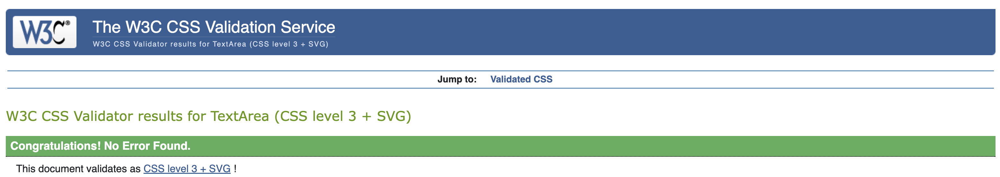
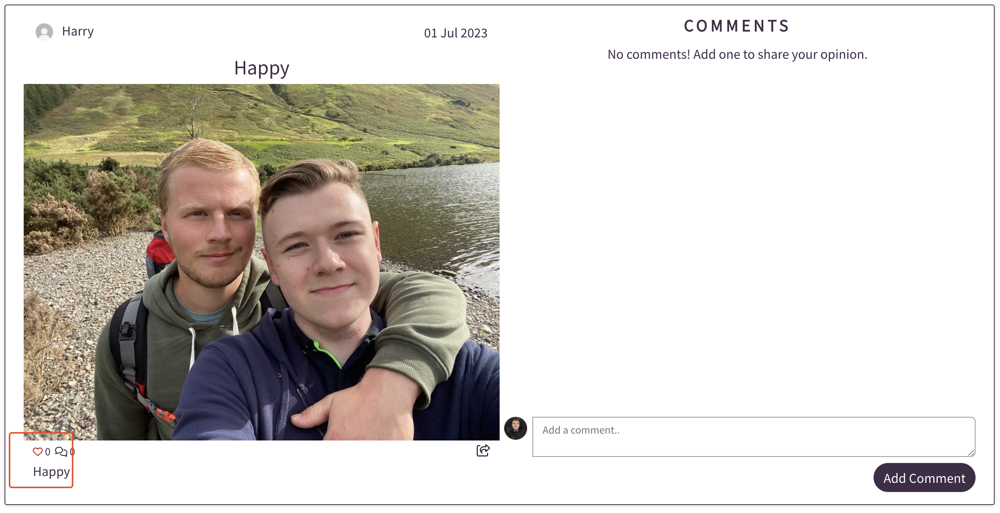
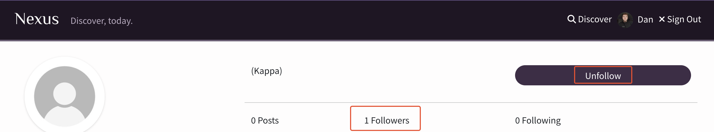

# Nexus
Developed by, [Dan Pearce](https://danpearce.software/)

[Live Website](https://ci-pp5-nexus-drf-danpearce.herokuapp.com/)

Welcome to Nexus! Nexus is a social network built using React. Inspired by Instagram, this site allows users to share their images in posts to interact with other users on the site. Nexus is a community of users who like to keep in touch and share experiences on social media.

Nexus is paired with its sister application Nexus DRF, which is an API using the Django Rest Framework.

You can read more about the DRF Application following the links below:

[View the live Nexus DRF application here](https://ci-pp5-nexus-danpearce.herokuapp.com/)

[View the Nexus DRF GitHub page here](https://github.com/DanPearce/CI_PP5_Nexus_DRF)

## Contents
1. [Application Goals and User Experience](#application-goals-and-user-experience)
    - [User Goals](#user-goals)
    - [Owner Goals](#owner-goals)
    - [Target Audience](#target-audience)
    - [User Expectations](#user-expectations)
2. [User Stories](#user-stories)
3. [Design](#design)
    - [FrontEnd Structure](#frontend-structure)
    - [BackEnd Structure](#backend-structure)
    - [Wireframes](#wireframes)
    - [Fonts and Icons](#fonts-and-icons)
    - [Colour](#colour)
4. [Main Features](#main-features)
5. [Technologies](#technologies)
    - [Languages](#languages)
    - [APIs](#apis)
    - [Libraries, Frameworks and Other Technologies](#libraries-frameworks-and-other-technologies)
6. [Validation and Testing](#validation-and-testing)
    - [HTML Validation](#html-validation)
    - [CSS Validation](#css-validation)
    - [ESLint JSX Validation](#eslint-jsx-validation)
    - [Accessibility Validation](#accessibility-validation)
    - [Performance Validation](#performance-validation)
    - [Device and Browser Compatibility](#device-and-browser-compatibility)
    - [User Story Testing](#user-story-testing)
    - [Bugs and Errors](#bugs-and-errors)
7. [Deployment](#deployment)
8. [Credits](#credits)
9. [Acknowledgements](#acknowledgements)

## Application Goals and User Experience
### User Goals
- Easily navigate throughout the website with ease.
- Easily distinguish if logged in, use the site in all states.
- Use Nexus to create content and share images.
- Use Nexus to interact with other users and their posts.

### Owner Goals
- Provide the user feedback while using the site.
- Provide the user and experience that is responsive.
- Ensure all users are able to easily naviagte throughout the site.

### Target Audience
- Lovers of social media, users who like to network and socialise using images.
- Users who like to follow their friends to keep up to date with their lives.
- People who like to share their images.

### User Expectations
- Experience use of the site on all devices, with a fully responsive experience.
- While navigating throughout the site, always able to understand where they are and how to get back.
- An interactive and engaging user interface that is easy to use.
- All links to be fully functioning and working throughout the site.

## User Stories
1. **USER STORY 1** : User Authentication - Profile Creation
    - As a User/Owner, I can create an account, so that I can have a user profile on the site.
2. **USER STORY 2**: User Authentication - Logging In/Out 
    - As a User, I can log into or out of my account, so that I can ensure that I can manage my profile/posts/comments.
3. **USER STORY 3**:
    - As an Owner, I can log into the admin console, so that I can moderate the content on the site. [Covered in the API Documentation](https://github.com/DanPearce/CI_PP5_Nexus_DRF)
4. **USER STORY 4**: User Interactivity - View Profiles
    - As a User, I can view all profiles, so that I can see who has posted and has an account.
5. **USER STORY 5**: User Interactivity – Profile Detail
    - As a User, I can view an individual profile, so that I can view it in full detail.
6. **USER STORY 6**: User Interactivity – Edit Profile Picture
    - As a User, I can change my profile picture, so that I can make my profile more recognisable.
7. **USER STORY 7**: User Interactivity – Edit Profile
    - As a User, I can edit my profile, so that I can modify the about me section.
8. **USER STORY 8**: User Interactivity – View Posts
    - As a User, I can view all posts, so that I can decide if I would like to interact with it.
9. **USER STORY 9**: User Interactivity – Post Detail
    - As a User, I can view an individual post, so that I can view it in full detail.
10. **USER STORY 10**: User Interactivity – Create a Post
    - As a User, I can create a post, so that I can add content to my profile.
11. **USER STORY 11**: User Interactivity – Edit Post
    - As a User, I can edit my own posts, so that I can make edits at a later stage, if needed.
12. **USER STORY 12**: User Interactivity – Delete Post
    - As a User, I can delete my own posts, so that I can manage the content on my profile.
13. **USER STORY 13**: User Interactivity – Like a Post
    - As a User, I can like a post, so that I can increase its popularity/show my interest.
14. **USER STORY 14**: User Interactivity – Unlike a Post
    - As a User, I can unlike a post, so that I can decrease its popularity/remove my interest.
15. **USER STORY 15**: User Interactivity – View Comments
    - As a User, I can view all comments, so that I can engage with the content.
16. **USER STORY 16**: User Interactivity – Create a Comment
    - As a User, I can create a comment, so that I can share my reaction to the content.
17. **USER STORY 17**: User Interactivity – Edit Comment
    - As a User, I can edit my own comment, so that I can make any necessary changes.
18. **USER STORY 18**: User Interactivity – Delete Comment
    - As a User, I can delete my own comments, so that I have control over my comments.
19. **USER STORY 19**: User Interactivity – Follow Profile
    - As a User, I can follow another profile, so that I can increase their follower count.
20. **USER STORY 20**: User Interactivity – Unfollow Profile
    - As a User, I can unfollow another profile, so that I can decrease their follower count.
21. **USER STORY 21**: User Statistics – View Followers Count
    - As a User, I can view the followers count for any profile, so that I can determine how many followers they have.
22. **USER STORY 22**: User Statistics – View Following Count
    - As a User, I can view the following count for any profile, so that I can determine how many profiles they are following.
23. **USER STORY 23**: User Interactivity – Search
    - As a User, I can search for posts/profiles, so that I can find the content I need.
24. **USER STORY 24**: User Interactivity – Filter
    - As a Owner, I can filter posts/profiles, so that I can find the content that I need. [Covered in the API Documentation](https://github.com/DanPearce/CI_PP5_Nexus_DRF)
25. **USER STORY 25**: User Interactivity – User Feedback
    - As a User, I am provided feedback when making changes to posts/profiles, so that I am sure the change was successful/unsuccessful.
26. **USER STORY 26**: User Authentication – Refresh Access Tokens
    - As a User, I expect Refresh Access Tokens to be in place, so that I can remain logged into the site on my computer.
27. **USER STORY 27**: User Interactivity – Continuous Content
    - As a User, I am presented with a continuous flow of posts, so that I do not need to re-load any content or cycle through pages.
28. **USER STORY 28**: Site Functionality – 404 Error Page
    - As a User, I am presented with a 404-error page when I have navigated to a page that does not exist, so that I can easily find my way back to the main site.
29. **USER STORY 29**: Site Functionality – Responsive Site
    - As a User, I am presented with a site that is fully responsive, so that I can consume the content on the site regardless of device or browser.
30. **USER STORY 30**: User Authentication – Change Password
    - As a User, I can change my password, so that I can keep my account secure.
31. **USER STORY 31**: Site Functionality – Navigation
    - As a User, I am presented with a site that I am able to navigate with ease, so that I can easily make my way around the site.

## Design
### FrontEnd Structure
#### React
The Front End structure of Nexus has been built using React.

React is a Javascript library that is populary used among Social Media Apps and Websites. React allows developers to create easily manipulate the interface and create individual components, which can be re-used and refreshed independantly of the page, allowing for faster loading times and more engaging content.

React has been used in Nexus as it provides a vast amount of manipulation and flexibility; React code is easier to maintain and offers a way to easily manage and store code.

The ability to reuse components greatly increases the devlopment time and allows code to be easily written. 

As React is the most popular library used by Social Media applications such as Twitter and Facebook, the future sustainablity of the code is also gaurenteed. This also is met with a vast support structure and documentation and how to use the library.

The loading time of an React application is also considerably quicker as the code invidiually loads compoents as they are needed. This results in fast loading speeds overal which provides users with a faster experience. 

Using React with React Bootstrap also allows us to easily manipulate the CSS code written on the site and greatly improves development time. 

#### Components
Nexus uses a various ammount of individual components, all designed with making development and user experience better overall.

**\<Asset />** is a component that is used to display various elements that is easily re-usbale. Dependant on the prop passed into this, we are easily able to render different elements to the page.

    - spinner (A page loading spinner)
    - src (An Image to be displayed)
    - message (a message to the user)
- User Stories: 27

**\<DropdownMenu />** is a component that is used throughout the site to display a dropdown to logged in users to allow the ability to edit and delete comments and posts, this is also used on the profile page to allow users to change their password or edit their profile.
- User Stories: 6, 7, 11, 12, 17, 18, 30

**\<LandingPage />** is a component that is only used for logged out users, this replaces the usual 'home' page and encourages new users to sign up.
- User Stories: 31

**\<NavBar />** is a is component that is used on every page that has the abiliy to change based on the users loggedIn status. Logged In users are able to access their profile directly from the navigation menu and are able to sign out.
- User Stories: 31

**\<PageNotFound />** is a component that is displayed when a user naviagtes to a page that does not yet exisit. The page displays a graphic that naviagtes users back to the home page.
- User Stories: 28

**\<PopularProfiles />** is a side component that is displayed next to all posts, this component provides a list of all the most popular profiles on the site.
- User Stories: 19, 20

**\<ProfilePicture />** is a component that is used to render the profile pictures of a user on the site. The Props passed into the component allow us to change the size. 
- User Stories: 6

**\<SideNavBar />** is a side component that is also displayed next to all the posts. This component is only visblie to users who are currently logged in, and displays additional links so the users are able to access content specific to their profile. This also allows them to share and add posts to the site.
- User Stories: 10, 31

### BackEnd Structure
The Back End Structure of the site has been built using the Django REST Framework. The Nexus DRF is an API that has been created to provide data to the Nexus application. Justification and in formation regarding the API is [covered in the API Documentation](https://github.com/DanPearce/CI_PP5_Nexus_DRF)
- User Stories: 3, 24

### Wireframes

Landing Page

Sign Up / Log In Page

Post Page

Add / Edit Post Page

Discover / Following / Liked Page

Profile Page

Edit Profile Page

Change Password Page

### Fonts and Icons
#### Fonts
The main font used throughout the website is [Noto Sans Japanese](https://fonts.google.com/noto/specimen/Noto+Sans+JP), this font offers a classic sans serif design and is easy on the eyes to read. This font is used for all text that isn't the logo.

The font used for the logo is [El Messiri](https://fonts.google.com/specimen/El+Messiri) and this has been chosen as this adds a unique flare to the Logo and allows us to draw attention to the logo on the main site.

#### Icons
I used [favicon.io](https://favicon.io/) to create the favicon icons for the site.

Icons from [Font Awesome](https://fontawesome.com/) we're also used throughout the site.

### Colour

The colours I have chosen on the site all are originated from the deep purple that can be found on the NavBar. I wanted to chose a colour that is different to the usual found on social media sites, and purple felt like the correct fit for Nexus!

I've also ensured to use varients of the colour at half opacity to allow for theming to be produced.

The slightly off white colour that is used is also appealing to the eyes as the text and background of the application. 

## Main Features
### Landing Page
The Landing Page has been implemented to welcome users, old and new, to the website, to clearly state what Nexus is about and define the clear intensions of the use of the application.

This is paired with navigational buttons and pointers to allow users to either sign up or log in to an account.

**User Stories Covered: 1, 2, 31**

### Sign Up page
The Sign Up page allows the user to speak directly with the API to create a user account. In doing so, the user unlocks the full potential of Nexus. This will in turn sign the user in and access tokens will be saved to their browser.

**User Stories Covered: 1, 2, 26**

### Sign In Page
The Sign In page allows user who already have an account to log back in so they can access the full features of the site. This action will save access tokens to the users browser.

**User Stories Covered: 1, 2, 26**

### Discover / Following / Liked Page
The Discover / Following / Liked pages act as the 'main' pages to the site.

Discover displays a list of all the posts that have been posted, and this is in decending date order.

Following displays a list of all the posts made to each account that your account is following. This is by defualt the 'home' page to allow content to be catered to you only.

Liked will display a list of all the posts that have been liked by your account.

**User Stories Covered: 8**

### Popular Profiles
The Popular Profiles section will display a list of the most popular profiles upon your time visiting the site. The site will display the top 10 profiles on a desktop and will show the top three whilst on mobbile. 

All profiles are easily viewable by clicking on the users name or profile icon.

**User Stories Covered: 4**

### Navigation
Nexus has two forms of navigational sections that are included in the application.

The NavBar is the main feature, and this is always present at the top of every page, no matter how you are viewing the site. Logged in users will have the added ability to log out and to also access their profile from this NavBar. Whereas logged out users will have the opportunity to 'sign up/in'.

The SideNavBar is visible once a user has logged in. Depending on the screen size, this will either be on the side or presented at the top of the page. This section has been made visible to logged in users only as this unlocks features only avaliable to them, such as adding a post, viewing the posts they have liked, or a quick link to view their following profiles.

**User Stories Covered: 31**

### Add Post Page
The Add Post page has been implemented as the main point of 'sharing' on the site, and allows users to upload their own content to their profile and account.

**User Stories Covered: 10**

### Post Page
The Post page offers a detailed look at the post the user has clicked on. The page features the description as well as the title and also gives details on the likes / comments count.

Comments are also visible on this page.

**User Stories Covered: 9, 11, 12, 15**

### Comments
The comments section of the page allows all users to view all the comments that have been added to the post and who commented this.

While logged in and being the owner of the comment, users are then able to add a comment, make changes to their comment, or have the ability to delete their comment. 

**User Stories Covered: 15, 16, 17, 18**

### Profile Page
The Profile page has been implemented to allow users to view all the content that has been posted by a particualr user. All their posts will be displayed in decending order.

If the user has gone to a profile which isn't their own, they will have the ability to follow / unfollow users from this page.

There are also various statistics displayed on this page, such as the users ammount of posts, ammount of followers and how many users they are following.

**User Stories Covered: 4, 5, 19, 20, 21, 22**

### Edit Profile
The Edit Profile page has been added to allow all users to make changes to their own profiles. 

Users are able to change their display name, about section and also their profile icon.

**User Stories Covered: 6, 7**

### Change Password
The Change Password section has been added to allow users to change the password to their account. This is added as a security feature.

**User Stories Covered: 30**

### Search
The Search function can be found on the Discover / Following / Liked page.

The feature allows users to search for content such as by searching a username or phrase to find the content they wish to view.

**User Stories Covered: 23**

### 404 Page
The 404 Error Page has been added as a fallback for users who might navigate to the wrong page or a page that doesn't exist. The page features a link to take users back home.

**User Stories Covered: 28**

### Like Posts
The Like Posts feature allows users have the ability to like / unlike posts.

Users are presented with a visual aid to let them know this has been actioned.

**User Stories Covered: 13, 14, 25**

### Infinite Content Scroll
The Infinite Scroll component has been added to allow content to be added to the site when it is needed.

By defualt all posts/comments are not shown to provide the user a faster loading time, as they scroll to find more content, this will load.

**User Stories Covered: 27**

## Technologies
### Languages
- [HTML](https://en.wikipedia.org/wiki/HTML5)
- [CSS](https://en.wikipedia.org/wiki/CSS)
- [JavaScript](https://en.wikipedia.org/wiki/JavaScript)
- [React](https://react.dev/)

### APIs
Nexus uses the specifically built Django Rest Framework API application. The Nexus DRF is an API that has been created to provide data to the Nexus application. Justification and in formation regarding the API is [covered in the API Documentation](https://github.com/DanPearce/CI_PP5_Nexus_DRF)

### Libraries, Frameworks and Other Technologies
- [Axios](https://axios-http.com/) - Used to make API requests to the DRF API. This was also used to prevent any CORS errors.
- [Boostrap](https://getbootstrap.com/) - Used to enhance my CSS code.
- [React Bootstrap](https://react-bootstrap.netlify.app/) Used to enhance the css code written with React.
- [Git](https://git-scm.com/) - Used to implement version control within the project.
- [GitHub](https://github.com/) Used to host my code.
- [GitPod](https://www.gitpod.io/) Used to build my code online.
- [VS Code](https://code.visualstudio.com) - Used occasionally to build the code offline.
- [Heroku](https://dashboard.heroku.com/) - Used to host the live version of the site.
- [Font Awesome](https://fontawesome.com/) - Used for the icons shown on the site.
- [Balsamiq](https://balsamiq.com/) - Used to create the Wireframes for the site.
- [Google Chrome Developer Tools](https://developers.google.com/web/tools/chrome-devtools) - Used for day-to-day testing and configuration of the site.
- [Google Fonts](https://fonts.google.com/) - Used for the two fonts featured on the site [Fonts](#fonts).
- [Favicon.io](https://favicon.io/) - Used to create the favicon featured on the site.
- [Am I Responsive? - ui.dev](https://ui.dev/amiresponsive) - Used to create the responsive images for the site.
- [Cloudinary](https://cloudinary.com/) - Used to host the images used on the live site.
- [JWT](https://jwt.io/) - Used to remove access tokens when a user logs out from the site. Also used to prevent unathenticated requests.
- [React Infinite Scroll Component](https://www.npmjs.com/package/react-infinite-scroll-component) - Used to prevent all posts/comments from loading at one time, allows them to load once scrolled into view.
- [React Router](https://reactrouter.com/en/main) - Used to enhasing the routing experience used in the application and allows more control over pages/components.
- [Coolors](https://coolors.co/) - Used to create the palette for this documentation.
- [Photopea](https://www.photopea.com/) - Used to make graphical chnanges to some of the images used on the site.
- [Enable JavaScript](https://www.enable-javascript.com/) - Link provided to allow users who don't have js enabled to find out how to turn this on.
- Validation:
    - [WC3 Markup Validation Serivce](https://validator.w3.org/) - Used to validate the HTML.
    - [W3C Jigsaw Validation Service](https://jigsaw.w3.org/css-validator/) - Used to validate the CSS.
    - [ESLint](https://eslint.org/) - Used to validate the JSX.
    - [WAVE - Web Accessibility Evaluation Tool](https://wave.webaim.org/) - Use to ensure the site is accessibile to all.
    - [Lighthouse](https://developers.google.com/web/tools/lighthouse) - Used to check performance of the site.

## Validation and Testing
### HTML Validation
The HTML has been tested using the [W3C Markup Validation Service](https://validator.w3.org/) in order validate the correct function of this site. All pages have passed with no errors or warnings.

Main Page

Sign Up Page

Sign In Page

Post Page

Post Create Page

Post Edit Page

Profile Page

Profile Edit Page

Change Password

404 Page

### CSS Validation
The [W3C Jigsaw Validation Service](https://jigsaw.w3.org/css-validator/) has been used to test the CSS of this website. The CSS has passed with no errors. Warnings shown have no effect on the styling and are used for webkits.

App.module.css

Asset.module.css

AuthForm.module.css

Button.module.css

Comment.module.css

CommentCreateForm.module.css

CommentEditForm.module.css

DropdownMenu.module.css

LandingPage.module.css

NavBar.module.css

Post.module.css

PostDiscover.module.css

PostPage.module.css

Profile.module.css

ProfilePicture.module.css

SideNavBar.module.css

### ESLint JSX Validation
The [ESLint](https://eslint.org/) tool has been downloaded and installed onto the editor during development of Nexus. The tool reads the JSX and looks for any errors. All code has passed and thrown no errors.

Components

Contexts

Hooks

App / Index

Pages - Auth

Pages - Comments

Pages - Posts

Pages - Profiles

Utils

### Accessibility Validation
The [WAVE - Web Accessibility Evaluation Tool](https://wave.webaim.org/) was used to test the accessibility function of the website, all pages have passed with no errors. 

Main Page

Sign Up Page

Sign In Page

Post Page

Post Create Page

Post Edit Page

Profile Page

Profile Edit Page

Change Password

404 Page

### Performance Validation
[Lighthouse](https://developers.google.com/web/tools/lighthouse) in the Google Chrome Developer Tools was used to test the performance of the website.

With more time to focus on the site this would be a section for further development as the performance isn't where I would like this for production.

Main Page

Post Page

### Device and Browser Compatibility
The project has been tested on numerous devices all of which result with full functionality and no visual issues the devices I tested on were as followed:
- MacBook Pro 16-inch 
- Desktop PC with 3 x Monitors
- iPhone 14 Pro Max
- iPad Pro 11inch
- Microsoft Surface Pro 3
- This site was also tested on all default Google Chrome Developer Tool screen sizes.

#### Browser Compatibility
The project was tested and viewed on the following browsers with no errors:
- [Google Chrome](https://en.wikipedia.org/wiki/Google_Chrome)
- [Mozilla Firefox](https://en.wikipedia.org/wiki/Firefox)
- [Microsoft Edge](https://en.wikipedia.org/wiki/Microsoft_Edge)
- [Apple Safari](https://en.wikipedia.org/wiki/Safari_(web_browser))
- [Vivaldi](https://vivaldi.com/)

### Manual Testing
#### User Story Testing

### User Story Testing
| **User Story 1** | **User Action** | **Desired Outcome** | **Actual Outcome** |
|------------------|-----------------|---------------------|--------------------|
| As a User/Owner, I can create an account, so that I can have a user profile on the site. | User navigates to the 'Sign Up' page, and enters credentials when prompted and clicks 'Sign Up'. | The user is able to create an account. | Works as intended. |
| 

User Story 1-1

 | | | 
| 

User Story 1-2

 | | |
| **User Story 2** | **User Action** | **Desired Outcome** | **Actual Outcome** |
|------------------|-----------------|---------------------|--------------------|
| As a User, I can log into or out of my account, so that I can ensure that I can manage my profile/posts/comments. | User navigates to the 'Sign In' page and enters their credentials and clicks 'Sign In'. | User is able to sign into their account. | Works as intended. |
| 

User Story 2-1

 | | | 
| 

User Story 2-2

 | | |
| 

User Story 2-3

 | | |
| **User Story 4** | **User Action** | **Desired Outcome** | **Actual Outcome** |
|------------------|-----------------|---------------------|--------------------|
| As a User, I can view all profiles, so that I can see who has posted and has an account. | User uses the search feature to find accounts, User also able to view 'popular profiles'. | User able to find profiles they want. | Works as intended. |
| 

User Story 4-1

 | | |
| 

User Story 4-2

 | | |
| 

User Story 4-3

 | | |
| **User Story 5** | **User Action** | **Desired Outcome** | **Actual Outcome** |
|------------------|-----------------|---------------------|--------------------|
| As a User, I can view an individual profile, so that I can view it in full detail. | User clicks on a users profile. | User able to see the profile. | Works as intended. |
| 

User Story 5

 | | |
| **User Story 6** | **User Action** | **Desired Outcome** | **Actual Outcome** |
|------------------|-----------------|---------------------|--------------------|
| As a User, I can change my profile picture, so that I can make my profile more recognisable. | User navigates to their Profile, Clicks the Meatball icon, and then edit profile. User is then able to upload a new Profile Icon. User clicks 'Update'. | User is able to change their profile picture. | Works as intended. |
| 

User Story 6-1

 | | |
| 

User Story 6-2

 | | |
| 

User Story 6-3

 | | |
| 

User Story 6-4

 | | |
| **User Story 7** | **User Action** | **Desired Outcome** | **Actual Outcome** |
|------------------|-----------------|---------------------|--------------------|
| As a User, I can edit my profile, so that I can modify the about me section. | User navigates to their Profile, Clicks the Meatball icon, and then edit profile. User is then able to upload a make changes to their profile about and display name. User clicks 'Update'. | User is able to make changes to their profile. | Works as intended. |
| 

User Story 7-1

 | | |
| 

User Story 7-2

 | | |
| 

User Story 7-3

 | | |
| 

User Story 7-4

 | | |
| **User Story 8** | **User Action** | **Desired Outcome** | **Actual Outcome** |
|------------------|-----------------|---------------------|--------------------|
| As a User, I can view all posts, so that I can decide if I would like to interact with it. | User browses the page using the 'Discover' tab, also able to use the 'Search' to find specific content. | User able to find posts they want to interact with. | Works as intended. |
| 

User Story 8-1

 | | |
| 

User Story 8-2

 | | |
| **User Story 9** | **User Action** | **Desired Outcome** | **Actual Outcome** |
|------------------|-----------------|---------------------|--------------------|
| As a User, I can view an individual post, so that I can view it in full detail. | User clicks on the post they wish to view. | The full post detail is shown. | Works as intended. |
| 

User Story 9

 | | |
| **User Story 10** | **User Action** | **Desired Outcome** | **Actual Outcome** |
|------------------|-----------------|---------------------|--------------------|
| As a User, I can create a post, so that I can add content to my profile. | User navigates to the 'Share' section. User is abe to make changes to the image, title and description. User hits 'Update'. | User able to add posts to Nexus. | Works as intended. |
| 

User Story 10-1

 | | |
| 

User Story 10-2

 | | |
| 

User Story 10-3

 | | |
| 

User Story 10-4

 | | |
| **User Story 11** | **User Action** | **Desired Outcome** | **Actual Outcome** |
|------------------|-----------------|---------------------|--------------------|
| As a User, I can edit my own posts, so that I can make edits at a later stage, if needed. | User navigates to the post they wish to edit, user clicks the 'Meatball' dropdown, user clicks edit post. User is able to make changes as they wish, click 'Update'. | User can make changes to their existing posts. | Works as intended. |
| 

User Story 11-1

 | | |
| 

User Story 11-2

 | | |
| 

User Story 11-3

 | | |
| 

User Story 11-4

 | | |
| **User Story 12** | **User Action** | **Desired Outcome** | **Actual Outcome** |
|------------------|-----------------|---------------------|--------------------|
| As a User, I can delete my own posts, so that I can manage the content on my profile. | | | Works as intended. |
| 

User Story 12

 | User navigates to the post they wish to edit, user clicks the 'Meatball' dropdown, user clicks 'delete post'. | The post is deleted from Nexus | Works as intended. |
| **User Story 13** | **User Action** | **Desired Outcome** | **Actual Outcome** |
|------------------|-----------------|---------------------|--------------------|
| As a User, I can like a post, so that I can increase its popularity/show my interest. | User clicks the hollow heart under the post they want to like. | User has added a like to the post. | Works as intended. |
| 

User Story 13-1

 | | |
| 

User Story 13-2

 | | |
| **User Story 14** | **User Action** | **Desired Outcome** | **Actual Outcome** |
|------------------|-----------------|---------------------|--------------------|
| As a User, I can unlike a post, so that I can decrease its popularity/remove my interest. | User clicks the whole heart under the post they wish to unlike. | User has unliked the post. | Works as intended. |
| 

User Story 14-1

 | | |
| 

User Story 14-2

 | | |
| **User Story 15** | **User Action** | **Desired Outcome** | **Actual Outcome** |
|------------------|-----------------|---------------------|--------------------|
| As a User, I can view all comments, so that I can engage with the content. | User navigates to the post they wish to view the comments on. | The comments are displayed next to the associated post. | Works as intended. |
| 

User Story 15

 | | |
| **User Story 16** | **User Action** | **Desired Outcome** | **Actual Outcome** |
|------------------|-----------------|---------------------|--------------------|
| As a User, I can create a comment, so that I can share my reaction to the content. | | | Works as intended. |
| 

User Story 16-1

 | User is able to add a comment by entering what they wish into the textbox, and clicking 'Add Comment'. | Comments are added to the post. | Works as intended. |
| 

User Story 16-2

 | | |
| **User Story 17** | **User Action** | **Desired Outcome** | **Actual Outcome** |
|------------------|-----------------|---------------------|--------------------|
| As a User, I can edit my own comment, so that I can make any necessary changes. | User navigates to the comment they wish to edit, user clicks the 'Meatball' dropdown, user clicks 'edit comment'. User makes changes and hits 'Update' | Changes are able to be made to existing comments. | Works as intended. |
| 

User Story 17-1

 | | |
| 

User Story 17-2

 | | |
| 

User Story 17-3

 | | |
| **User Story 18** | **User Action** | **Desired Outcome** | **Actual Outcome** |
|------------------|-----------------|---------------------|--------------------|
| As a User, I can delete my own comments, so that I have control over my comments. | User navigates to the comment they wish to delete, user clicks the 'Meatball' dropdown, user clicks 'Delete Comment'. | The comment is deleted from Nexus. | Works as intended. |
| 

User Story 18-1

 | | |
| 

User Story 18-2

 | | |
| **User Story 19** | **User Action** | **Desired Outcome** | **Actual Outcome** |
|------------------|-----------------|---------------------|--------------------|
| As a User, I can follow another profile, so that I can increase their follower count. | User navigates to the profile they wish to follow, user clicks 'Follow'. | User is able to follow another user. | Works as intended. |
| 

User Story 19-1

 | | |
| 

User Story 19-2

 | | |
| **User Story 20** | **User Action** | **Desired Outcome** | **Actual Outcome** |
|------------------|-----------------|---------------------|--------------------|
| As a User, I can unfollow another profile, so that I can decrease their follower count. | User navigates to the profile they wish to unfollow, user clicks 'Unfollow'. | User is able to unfollow another user. | Works as intended. |
| 

User Story 20-1

 | | |
| 

User Story 20-2

 | | |
| **User Story 21** | **User Action** | **Desired Outcome** | **Actual Outcome** |
|------------------|-----------------|---------------------|--------------------|
| As a User, I can view the followers count for any profile, so that I can determine how many followers they have. | User navigates to the profile they wish to view the followers_count on. | The 'Followers' number is displayed. | Works as intended. |
| 

User Story 21

 | | |
| **User Story 22** | **User Action** | **Desired Outcome** | **Actual Outcome** |
|------------------|-----------------|---------------------|--------------------|
| As a User, I can view the following count for any profile, so that I can determine how many profiles they are following. | User navigates to the profile they wish to view the following_count on. | The 'Following' number is displayed. |  Works as intended. |
| 

User Story 22

 | | |
| **User Story 23** | **User Action** | **Desired Outcome** | **Actual Outcome** |
|------------------|-----------------|---------------------|--------------------|
| As a User, I can search for posts/profiles, so that I can find the content I need. | User navigates to the discover tab, uses the search function. | User is able to use search to find content they want. | Works as intended. |
| 

User Story 23-1

 | | |
| 

User Story 23-2

 | | |
| **User Story 25** | **User Action** | **Desired Outcome** | **Actual Outcome** |
|------------------|-----------------|---------------------|--------------------|
| As a User, I am provided feedback when making changes to posts/profiles, so that I am sure the change was successful/unsuccessful. | | | |
| | | |
| | | |
| | | |
| **User Story 26** | **User Action** | **Desired Outcome** | **Actual Outcome** |
|------------------|-----------------|---------------------|--------------------|
| As a User, I expect Refresh Access Tokens to be in place, so that I can remain logged into the site on my computer. | User refreshes their page, or even closes their browser. | User remains logged in upon refresh/opening. | Works as intended. |
| 

User Story 26-1

 | | |
| 

User Story 26-2

 | | |
| **User Story 27** | **User Action** | **Desired Outcome** | **Actual Outcome** |
|------------------|-----------------|---------------------|--------------------|
| As a User, I am presented with a continuous flow of posts, so that I do not need to re-load any content or cycle through pages. | User scrolls to the end of the displayed content. | More content is displayed once reaching the end of the displayed content. | Works as intended. |
| 

User Story 27

 | | |
| **User Story 28** | **User Action** | **Desired Outcome** | **Actual Outcome** |
|------------------|-----------------|---------------------|--------------------|
| As a User, I am presented with a 404-error page when I have navigated to a page that does not exist, so that I can easily find my way back to the main site. | User navigates to a page that does not exist. | User is presented with a 404 page with navigation back. | Works as intended. |
| 

User Story 28

 | | |
| **User Story 29** | **User Action** | **Desired Outcome** | **Actual Outcome** |
|------------------|-----------------|---------------------|--------------------|
| As a User, I am presented with a site that is fully responsive, so that I can consume the content on the site regardless of device or browser. | User uses Nexus on various platforms. | The application is still fully functional. | Works as intended. |
| 

User Story 29-1

 | | |
| 

User Story 29-2

 | | |
| 

User Story 29-3

 | | |
| **User Story 30** | **User Action** | **Desired Outcome** | **Actual Outcome** |
|------------------|-----------------|---------------------|--------------------|
| As a User, I can change my password, so that I can keep my account secure. | User naviagtes to their profile, hits the 'Meatball' dropdown, selects 'Change Password'. User enters their new password into the feilds, clicks 'Update'. | User can change their password. | Works as intended. |
| 

User Story 30-1

 | | |
| 

User Story 30-2

 | | |
| **User Story 31** | **User Action** | **Desired Outcome** | **Actual Outcome** |
|------------------|-----------------|---------------------|--------------------|
| As a User, I am presented with a site that I am able to navigate with ease, so that I can easily make my way around the site. | User makes use of the NavBar elements. | User can naviagte around the site. | Works as intended. |
| 

User Story 31

 | | |
### Bugs and Errors

## Deployment

## Credits

## Acknowledgements

#### [Back to Top](#contents)